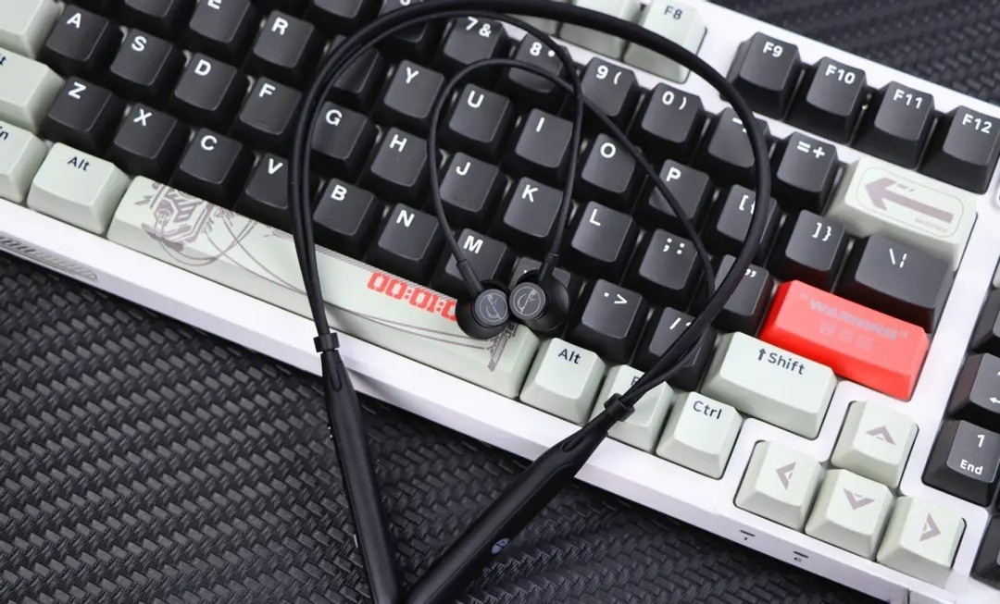
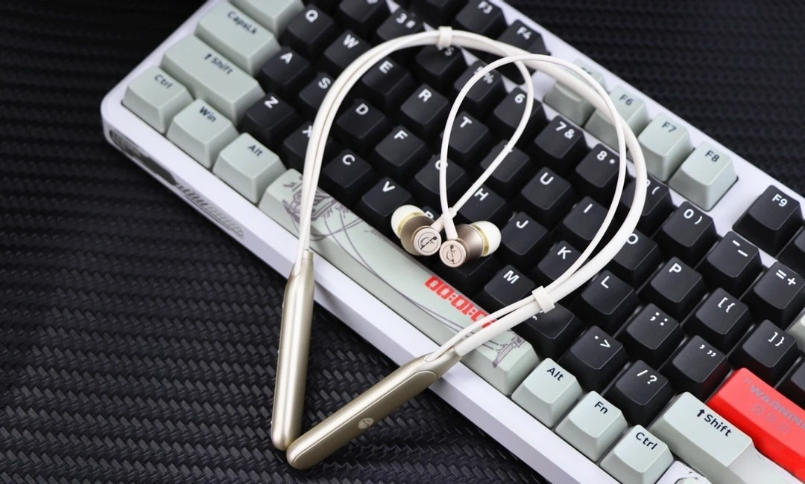

## 前言

在工作的时候，携带盒装蓝牙耳机不方便，频繁摘戴的过程繁琐。经过一番搜索和测评视频的观看，我发现了两种选择：骨传导耳机和颈挂式耳机。最终，我选择了颈挂式耳机，因为它完美地解决了我的痛点——无需耳机盒，随取随戴，使用起来极为方便。音质方面，我并没有太多苛求，毕竟耳机主要是用来听个响。

## 体验

### 明显缺点

- **耳机头吸合不能自动暂停**

### 显著优点

- **便捷性**: 无需耳机盒，随听随取，非常方便。
- **续航能力强**: 一次充满电后，即使频繁使用，也能续航3-5天。
- **线材耐用**: 设计 robust，经久耐用，不易损坏。
- **吸汗性能好**: 运动时使用，汗水不易影响使用体验。

## 购买链接

:::important
[京东链接](https://item.jd.com/10100975745157.html)
:::
